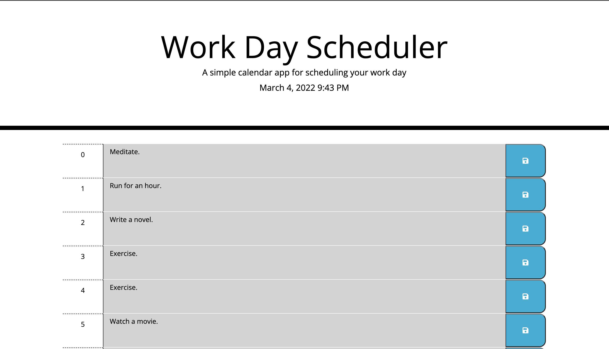

# Calendar-planner-JS

The best task planner in the market made with JavaScript.

## Description

Calendar-planner-JS is a daily task planner for organizing your everyday routine in the most efficient and convenient
way. Made with JavaScript and Jquery, it is a fast and light weight application ready to use.

## Usage

Using Calendar-planner-JS is easy! Just type the activities you need to complete throughout the day and click save and
that's it!


## Installation

You can clone the project from the [repository](https://github.com/JanInquisitor/Calendar-planner-JS).

```
git clone https://github.com/JanInquisitor/Calendar-planner-JS
```

## Contributing

Anyone is welcome to contribute to this project.

## License

See the [LICENSE](https://www.google.com/) file for information.


